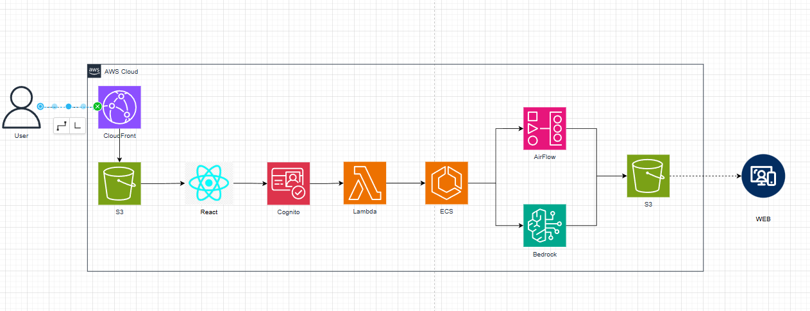

# 🎯 DAI-Ly - 웹캠 기반 학습 집중도 분석 시스템

웹캠만으로 시선 흐름·고개 방향·눈 깜빡임 데이터를 수집하여 학습 집중도를 분석하고, AI가 학생 개인 맞춤형 학습 피드백 리포트를 자동으로 생성하는 **AWS 기반 학습 집중도 분석 플랫폼**입니다.

태블릿·스마트기기 기반 수업이 확대되면서 학생이 화면을 보고 있어도 실제로 집중하고 있는지 파악할 수 없는 문제가 발생하고 있습니다. 기존 학습 관리 도구는 학습 시간만 측정할 뿐, 집중의 질을 정량적으로 측정하는 수단이 없었습니다.

이에 웹캠만으로 시선 흐름·고개 방향·눈 깜빡임 데이터를 수집하고, AWS S3에 저장된 데이터를 Apache Airflow 파이프라인이 집중도 지표로 분석한 뒤, Amazon Bedrock Claude가 학생 개인 맞춤형 학습 피드백 리포트를 자동으로 생성하는 시스템을 개발했습니다.

---

## 📌 프로젝트 개요

* **프로젝트명**: DAI-Ly (웹캠 기반 학습 집중도 분석 리포트)
* **개발 기간**: 2026.05 ~ 2026.05
* **팀 구성**: 4인
* **프로젝트 유형**: 해커톤 프로젝트 (2026 상명대학교 해커톤)
* **프로젝트 목적**: 웹캠 기반 시선 추적을 통한 개인 맞춤형 학습 집중도 분석 시스템 구축

### 주요 기술

* **Frontend**: React, Vite, Tailwind CSS, MediaPipe
* **Backend / Pipeline**: Python, Apache Airflow, NumPy, boto3
* **Cloud**: AWS S3, AWS Cognito, AWS Lambda, AWS ECS (Fargate), AWS ECR, AWS Bedrock, AWS Amplify
* **Deployment**: Docker, Docker Compose

---

## 🎯 프로젝트 목표

웹캠 기반 시선 추적으로 다음 기능을 제공하는 것을 목표로 했습니다.

* 웹캠만으로 시선·고개 방향·눈 깜빡임 실시간 추적
* 개인별 캘리브레이션 기반 집중도 산출
* AWS 이벤트 기반 자동화 파이프라인 구축
* Amazon Bedrock Claude를 활용한 개인 맞춤형 학습 피드백 리포트 자동 생성
* 로컬·클라우드 환경 전환이 용이한 컨테이너 기반 배포 구조 구축

---

## 🛠️ Tech Stack

### Frontend

* React
* Vite
* Tailwind CSS
* MediaPipe Face Landmarker
* AWS Amplify

### Backend / Pipeline

* Python
* Apache Airflow
* NumPy
* boto3

### Cloud

* AWS S3
* AWS Cognito
* AWS Lambda
* AWS ECS (Fargate)
* AWS ECR
* AWS Bedrock

### Deployment & Development

* Docker
* Docker Compose
* Git
* GitHub

---

## 👨‍💻 담당 역할

### Apache Airflow 파이프라인 설계 및 인프라 구성 담당

* S3에 저장된 시선 데이터를 단계별로 처리하는 4단계 Airflow DAG 설계 및 구현
* S3 데이터 로드 → Feature Extraction → Bedrock AI 리포트 생성 → S3 저장
* docker-compose로 Airflow 웹서버·스케줄러·워커를 로컬에서 단일 명령으로 실행 가능한 개발 환경 구성
* ECS Fargate 배포를 고려한 컨테이너 이미지 설계 및 환경변수 기반 설정 분리로 로컬·클라우드 환경 전환 용이하게 구성
* 정면·좌우·상하 응시 및 고개 방향 캘리브레이션으로 개인별 시선 범위와 분산 기준값을 산출하는 로직 설계
* 시선 이탈, 시선 흔들림, 눈 깜박임을 캘리브레이션 기준값 대비 상대적으로 비교하는 rule-based scoring 구현

---

## 🏗️ System Architecture




## 📋 주요 기능

## 1. 웹캠 기반 실시간 시선 추적

MediaPipe Face Landmarker를 활용하여 웹캠 영상에서 시선 흐름, 고개 방향, 눈 깜빡임 데이터를 실시간으로 수집합니다.

```text
Webcam
  ↓
MediaPipe Face Landmarker
  ↓
시선 / 고개 방향 / 눈 깜빡임 데이터
  ↓
S3 Raw Data 업로드
```

---

## 2. 개인별 캘리브레이션 기반 집중도 산출

절대적인 고정 기준값이 아닌, 테스트 시작 전 캘리브레이션 단계에서 개인별 시선 범위와 분산 기준값을 직접 측정하도록 설계했습니다.

### 캘리브레이션 흐름

```text
정면 응시
  ↓
좌우 응시
  ↓
상하 응시
  ↓
고개 방향 캘리브레이션
  ↓
개인별 시선 범위 / 분산 기준값 산출
```

이후 실제 테스트에서 발생하는 시선 이탈, 시선 흔들림, 눈 깜빡임을 캘리브레이션 기준값 대비 상대적으로 비교하는 **rule-based scoring**을 적용하여 개인차를 반영한 집중도를 산출합니다.

---

## 3. Apache Airflow 기반 4단계 데이터 파이프라인

S3에 저장된 시선 데이터를 단계별로 처리하는 4단계 DAG 파이프라인을 구현했습니다.

```text
load_s3_data
  ↓
extract_features
  ↓
invoke_bedrock
  ↓
save_report
```

* **load_s3_data**: S3에 업로드된 원본 시선 데이터를 로드
* **extract_features**: 캘리브레이션 기준값 대비 시선 이탈·흔들림·깜박임 지표 추출
* **invoke_bedrock**: 추출된 지표를 바탕으로 Amazon Bedrock Claude가 자연어 피드백 리포트 생성
* **save_report**: 생성된 리포트를 S3에 저장

---

## 4. Amazon Bedrock 기반 AI 학습 피드백 리포트 생성

Airflow DAG 내에서 Amazon Bedrock Claude를 호출하여, 추출된 집중도 지표를 기반으로 학생 개인 맞춤형 학습 피드백 리포트를 자동으로 생성합니다.

---

## 🧩 AWS 서비스 구성

| 서비스 | 역할 |
| --- | --- |
| Amplify | 프론트엔드 호스팅 |
| Cognito | 사용자 인증 |
| S3 | 원본 시선 데이터 및 리포트 저장 |
| Lambda | S3 업로드 이벤트 처리 및 파이프라인 트리거 |
| ECS (Fargate) | Airflow 컨테이너 실행 |
| ECR | Docker 이미지 저장소 |
| Bedrock | AI 학습 집중도 리포트 생성 |

---

# 🔥 Trouble Shooting

## 1. MWAA 비용 문제로 인한 아키텍처 전환

### 문제

워크플로우 관리를 위해 AWS MWAA 도입을 검토하였으나 고정 유지 비용이 프로젝트 예산 대비 과도하게 높았습니다.

### 원인

MWAA는 클러스터가 유휴 상태에서도 고정 비용이 발생하는 과금 구조입니다.

### 해결

Airflow를 Docker 컨테이너화하여 ECS Fargate 위에서 직접 구동하고, Lambda 트리거로 필요 시에만 실행되도록 전환하여 비용을 획기적으로 절감했습니다.

```text
MWAA (상시 클러스터, 고정 비용)
      ↓ 전환
Docker + ECS Fargate (Lambda 트리거 시에만 실행)
```

---

## 2. 집중도 기준값 설계 문제

### 문제

DAiSEE 데이터셋 기반 집중도 분석을 검토했으나, DAiSEE는 OpenFace 기반이라 MediaPipe 수치와 직접 비교가 불가능했습니다.

### 원인

OpenFace와 MediaPipe의 feature 추출 방식이 달라 수치 스케일이 상이합니다.

### 해결

DAiSEE의 feature 개념(시선 불안정, 깜박임, 고개 방향 등)만 참고하고, 실제 수치는 테스트 전 캘리브레이션으로 개인별 기준값을 직접 측정하는 방식으로 전환했습니다.

```text
DAiSEE (OpenFace 기반, 절대 수치)
      ↓ 전환
개인별 캘리브레이션 (MediaPipe 기반, 상대 수치)
```

---

# 🐳 Docker & Deployment

Docker를 이용하여 Airflow를 컨테이너 환경에서 실행할 수 있도록 구성했으며, 로컬 개발 환경과 ECS Fargate 배포 환경을 환경변수 기반으로 분리했습니다.

### Docker Compose (로컬 개발)

```text
Docker Compose
      │
      └── Airflow
             ├── Webserver
             ├── Scheduler
             └── Worker
```

```bash
cd airflow-focus
docker-compose up
```

docker-compose로 Airflow 웹서버·스케줄러·워커를 로컬에서 단일 명령으로 실행 가능한 개발 환경을 구성했습니다.

### ECS Fargate 배포

로컬에서 사용한 것과 동일한 컨테이너 이미지를 ECS Fargate에 배포하며, 환경변수 기반 설정 분리로 로컬·클라우드 환경 전환을 용이하게 구성했습니다.

```text
Local (docker-compose)
      ↓ 동일 이미지
ECS Fargate (Lambda 트리거 실행)
```

---

---

# 📊 핵심 구현 정리

| 영역 | 구현 내용 |
| --- | --- |
| Frontend | React + Vite + MediaPipe 기반 실시간 시선 추적 |
| Pipeline | Apache Airflow 4단계 DAG (로드 → 추출 → AI 리포트 생성 → 저장) |
| 집중도 산출 | 개인별 캘리브레이션 기반 rule-based scoring |
| AI 리포트 | Amazon Bedrock Claude 연동 |
| 자동화 | S3 업로드 이벤트 → Lambda → Airflow 트리거 |
| Container | Docker / Docker Compose / ECS Fargate |
| 비용 최적화 | MWAA → ECS Fargate + Lambda 트리거 전환 |

---

# 💡 프로젝트를 통해 얻은 경험

이 프로젝트를 통해 단순한 데이터 수집을 넘어 **웹캠 데이터를 의미 있는 학습 지표로 변환하는 파이프라인을 직접 설계하는 경험**을 했습니다.

특히 Apache Airflow DAG를 설계하면서 S3 데이터 로드부터 Feature Extraction, AI 리포트 생성, 저장까지 이어지는 단계별 데이터 흐름을 구조화하는 방법을 익혔습니다.

또한 AWS MWAA 도입을 검토하다 비용 문제로 Docker 기반 ECS Fargate 구조로 전환하면서, **관리형 서비스와 직접 구축한 인프라 사이의 비용·운영 트레이드오프**를 실제로 경험할 수 있었습니다.

집중도 기준값 설계 과정에서는 공개 데이터셋(DAiSEE)의 한계를 파악하고, 이를 그대로 가져다 쓰는 대신 **개인별 캘리브레이션이라는 대안적 접근으로 문제를 재정의**하는 경험을 했습니다.

이를 통해 요구사항 분석부터 데이터 파이프라인 설계, 인프라 비용 최적화, 외부 AI 서비스 연동까지 **AWS 기반 데이터 서비스의 전체적인 개발 과정**을 경험할 수 있었습니다.
